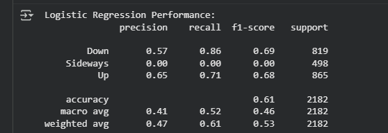

# 📈 Stock Price Prediction: From Market Crash to Machine Learning

A lot of people in India invest in stocks, hoping to build a second income. What many don’t realize early on is how risky it can be without proper guidance.

I saw this firsthand. My parents used to invest based on broker tips, and I followed suit in early 2008—just before the global crash. I lost most of my investment out of fear, and my parents took a hit too. It took me nearly a decade to regain confidence in the markets.

Today, I approach investing differently—guided by data, fundamentals, and long-term thinking. And now, I’ve taken it a step further by applying machine learning to stock prediction.

---

## 🧠 Project Overview: Predicting Stock Movement After 6 Months

Together with my friend [[Aditya Rathore](https://www.linkedin.com/in/aditya-rathore-8189b421a/)) and mentor [Rajeev Ranjan](https://www.linkedin.com/in/rajeev-ranjan4j/), we built a model to classify stock movement after 6 months as:

- 📈 **Up** (> +15%)
- 📉 **Down** (< –15%)
- ➡️ **Sideways** (between –15% and +15%)

---

## 🛠️ Technical Highlights

### 📊 Data Source
- NIFTY-50 daily stock data (2000–2021) from NSE India
- Stocks used: `ADANIPORTS`, `AXISBANK`, `BAJAJ-AUTO`, `RELIANCE`

### 🧹 Preprocessing
- Removed irrelevant columns: `Trades`, `Deliverable Volume`, `%Deliverable`
- Handled missing values and symbol inconsistencies
- Adjusted prices for stock splits to avoid misleading volatility

### 🧮 Feature Engineering
- 1-Month Return & Volatility
- SMA (20, 50, 100), RSI, VWAP, Volume

### 🎯 Target Variable
- Multi-class label based on 6-month future return

### 🤖 Modeling
- Algorithms tried: Logistic Regression, Random Forest, SVM, KNN, XGBoost
- Time-based train-test split to avoid look-ahead bias
- Evaluation metrics: Precision, Recall, F1-score, Confusion Matrix

---

## 📊 Key Learnings

### 📌 Stock Splits Matter
Sudden drops in stock prices were often due to **stock splits**, not market crashes. For example:

- In a 2-for-1 split, each shareholder gets 2 shares for every 1 they owned.
- The share price is halved, but total investment value remains the same.

**Why adjust for splits?**
- To maintain historical price consistency
- Prevents models from misinterpreting split-induced drops as volatility

### 📌 Data Aggregation Helps
- Modeling individual stocks: F1-score ≈ 0.54
- Aggregated multi-stock modeling: F1-score improved to ≈ 0.61

### 📌 API Limitations
- Indian stock APIs don’t reliably return stock split data
- Manual adjustments still required for accurate modeling

---

## 📷 Sample Visuals

### Model Performance 

As we can see the f1 score is 0.61 but it fails to detect sideways class. if you balance out the class it detects the sideways class but the performance decreases.
### Stock Split Adjustment Example

- Bajaj auto does not have a stock split hence the graph is unchanged
---

## 🤝 Let’s Connect

This project helped me bridge my past investing experience with my current data analytics skillset. It’s a reminder that markets are complex—but with the right tools and mindset, we can navigate them smarter.

If you're working on similar projects or have ideas to tackle the API challenge or improve model performance, I’d love to connect!

---

## 🔖 Tags

`#MachineLearning` `#StockPrediction` `#Nifty50` `#DataAnalytics` `#Finance` `#Python` `#MLProjects` `#LinkedInLearning` `#skidevinc` `#reliance` `#adaniports` `#bajajauto` `#axisbank`

